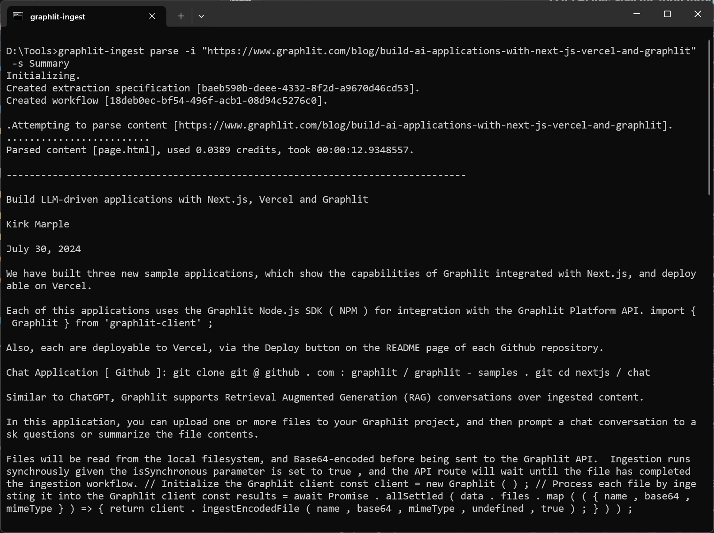

## Configuration

- Edit appsettings.json, and assign your project credentials to GRAPHLIT_ORGANIZATION_ID, GRAPHLIT_ENVIRONMENT_ID, GRAPHLIT_JWT_SECRET
- Optionally, assign your OpenAI (OPENAI_API_KEY) or Anthropic API keys (ANTHROPIC_API_KEY) if you want to use your own LLM accounts. Also, you can configure your preferred vision-enabled model be assigning ANTHROPIC_MODEL or OPENAI_MODEL.

## Build

Right-click on GraphlitIngest project, and select Publish.  Choose between win-x64 and linux-x64 publishing profiles. Open Terminal in the published folder, i.e. bin\Release\net8.0\win-x64\publish\win-x64\.

## Usage

Parse document, audio or image files or web pages with the Graphlit Platform.

### Command-Line Examples

``` bash
graphlit-ingest parse -i "https://graphlitplatform.blob.core.windows.net/samples/Attention%20Is%20All%20You%20Need.1706.03762.pdf"

graphlit-ingest parse -i "https://www.graphlit.com/blog/build-ai-applications-with-next-js-vercel-and-graphlit" -s Summary

graphlit-ingest parse -i "https://graphlitplatform.blob.core.windows.net/samples/Unstructured%20Data%20is%20Dark%20Data%20Podcast.mp3" -s Chapters

graphlit-ingest parse -i "https://graphlitplatform.blob.core.windows.net/samples/BERT.1810.04805.pdf" -f JSON -o c:\temp\document.json
```

### Command-Line Options

``` bash
> graphlit-ingest parse --help

  -s, --summarization-type    Summarization Type

  -l, --llm-type              (Default: Anthropic) LLM Type

  -p, --preparation-type      (Default: Default) Preparation Type

  -f, --output-format         (Default: Markdown) Output Format

  -i, --input                 Required. File or Webpage URI, or Local File Path

  -o, --output-file-path      Output File Path

  --help                      Display this help screen.

  --version                   Display version information.
```

#### Source 

You can provide a URI to a file or web page, or a local file path on your computer.

``` bash
-i [uri]

-i [local file path]
```

#### Output File Path

Provide a local file path to write the parsed output from the source.

``` bash
-o [local file path]
```

#### Output Format

Provide the format for the parse output, either Markdown or the Graphlit JSON format.

``` bash
-f Markdown

-f JSON
```

#### Preparation Type

Choose the preparation type, either LLM-based preparation or default (which uses Azure AI Document Intelligence for PDF, DOCX, PPTX).

``` bash
-p LLM

-p Default
```

#### LLM Type

Choose the LLM to be used for LLM-based preparation. By default, Anthropic uses the Sonnet 3.5 model, and OpenAI uses the GPT-4o 08-06 model. For most use cases, Anthropic Sonnet 3.5 currently gives more accurate document preparation.

``` bash
-l Anthropic

-l OpenAI
```

#### Summarization Type

Choose the summarization type of the parsed source.

``` bash
-s [Summary | Keywords | Bullets | Headlines | Posts | Questions | Chapters ]
```

Chapters only applies to audio or video files, which have been transcribed.


## Example



``` bash
> graphlit-ingest parse -i "https://www.graphlit.com/blog/build-ai-applications-with-next-js-vercel-and-graphlit" -s Summary
```

``` markdown
Initializing.
Created extraction specification [e4adcb15-1cd5-4648-8532-e1ff4c5a9e27].
Created workflow [59498331-2ca8-4197-967a-aa2611f896d8].

Attempting to parse content [https://www.graphlit.com/blog/build-ai-applications-with-next-js-vercel-and-graphlit].
.................
Parsed content [page.html], used 0.0009 credits, took 00:00:07.9856202.

--------------------------------------------------------------------------------

Build LLM-driven applications with Next.js, Vercel and Graphlit

Kirk Marple

July 30, 2024

We have built three new sample applications, which show the capabilities of Graphlit integrated with Next.js, and deployable on Vercel.

Each of this applications uses the Graphlit Node.js SDK ( NPM ) for integration with the Graphlit Platform API. import { Graphlit } from 'graphlit-client' ;

Also, each are deployable to Vercel, via the Deploy button on the README page of each Github repository.

Chat Application [ Github ]: git clone git @ github . com : graphlit / graphlit - samples . git cd nextjs / chat

Similar to ChatGPT, Graphlit supports Retrieval Augmented Generation (RAG) conversations over ingested content.

In this application, you can upload one or more files to your Graphlit project, and then prompt a chat conversation to ask questions or summarize the file contents.

Files will be read from the local filesystem, and Base64-encoded before being sent to the Graphlit API.  Ingestion runs synchrously given the isSynchronous parameter is set to true , and the API route will wait until the file has completed the ingestion workflow. // Initialize the Graphlit client const client = new Graphlit ( ) ; // Process each file by ingesting it into the Graphlit client const results = await Promise . allSettled ( data . files . map ( ( { name , base64 , mimeType } ) => { return client . ingestEncodedFile ( name , base64 , mimeType , undefined , true ) ; } ) ) ;

Then, when the user enters a prompt, it will be sent to the default LLM (OpenAI GPT-4o, at the time of publishing) for completion. // Initialize the Graphlit client const client = new Graphlit ( ) ; // Send the prompt to the conversation const promptResults = await client . promptConversation ( data . prompt , data . conversationId ) ;

### Previous conversations can be queried, and as a conversation is selected, the application loads the previous messages. // Initialize the Graphlit client const client = new Graphlit ( ) ; // Query the Graphlit client for conversations const conversationResults = await client . queryConversations ( ) ; // Extract the conversations from the results const response = conversationResults . conversations ;

Web Extraction Application [ Github ]: git clone git @ github . com : graphlit / graphlit - samples . git cd web - extraction

#### Graphlit can be used to scrape webpages or crawl websites and extract text, even without using the text for a RAG conversation.

Scrape

This sample application demonstrates how to scrape a webpage by URL, and then display the extracted Markdown text and structured JSON output.

#### // Initialize the Graphlit client const client = new Graphlit ( ) ; // Ingest the URI into the Graphlit client const response = await client . ingestUri ( data . uri , undefined , undefined , true ) ;

Crawl

This sample application also demonstrates how to crawl a website by URL, walking the pages via sitemap.  The application then displays the extracted Markdown text and structured JSON output of all crawled pages.

// Initialize the Graphlit client const client = new Graphlit ( ) ; // Create a new feed for the specified URI const response = await client . createFeed ( { name : data . uri , type : FeedTypes . Web , web : { uri : data . uri , readLimit : data . limit , } , } ) ;

File Extraction Application [ Github ]: git clone git @ github . com : graphlit / graphlit - samples . git cd file - extraction

In addition to extracting text from webpages, Graphlit supports extracting text from documents, such as PDFs and Word documents.

Similar to the Chat sample application, the File Extraction application demonstrates how to upload a local file.  Once ingested, the application displays the extracted Markdown text and structured JSON output. // Initialize the Graphlit client const client = new Graphlit ( ) ; // Ingest each file and handle results const results = await Promise . allSettled ( data . files . map ( ( { name , base64 , mimeType } ) => client . ingestEncodedFile ( name , base64 , mimeType , undefined , true ) ) ) ;

Summary

Please email any questions on this article or the Graphlit Platform to questions@graphlit.com .

For more information, you can read our Graphlit Documentation , visit our marketing site , or join our Discord community .

--------------------------------------------------------------------------------

Summary:

Graphlit is an API-first platform designed for developers building AI-powered applications with unstructured data across various vertical markets such as legal, sales, entertainment, healthcare, and engineering. Recently, three new sample applications have been developed to showcase the capabilities of Graphlit when integrated with Next.js and deployed on Vercel. Each application utilizes the Graphlit Node.js SDK for seamless integration with the Graphlit Platform API and can be easily deployed to Vercel via the Deploy button on the README page of each GitHub repository.

The Chat Application, similar to ChatGPT, supports Retrieval Augmented Generation (RAG) conversations over ingested content. Users can upload files to their Graphlit project and prompt chat conversations to ask questions or summarize the file contents. The files are read from the local filesystem, Base64-encoded, and sent to the Graphlit API for synchronous ingestion. Prompts are then sent to the default LLM (OpenAI GPT-4 at the time of publishing) for completion. Previous conversations can be queried, and the application loads previous messages when a conversation is selected.

The Web Extraction Application demonstrates how to scrape webpages or crawl websites to extract text, even without using the text for a RAG conversation. The scraping feature allows users to input a webpage URL and display the extracted Markdown text and structured JSON output. The crawling feature enables users to input a website URL, walk through the pages via sitemap, and display the extracted Markdown text and structured JSON output of all crawled pages.

The File Extraction Application supports extracting text from documents such as PDFs and Word documents. Similar to the Chat Application, users can upload local files, which are then ingested by the Graphlit client. The application displays the extracted Markdown text and structured JSON output once the files are processed. This feature is particularly useful for handling various document types and extracting meaningful information from them.

For further inquiries about the article or the Graphlit Platform, users are encouraged to email questions@graphlit.com. Additional information can be found in the Graphlit Documentation, on the marketing site, or by joining the Discord community.
```
