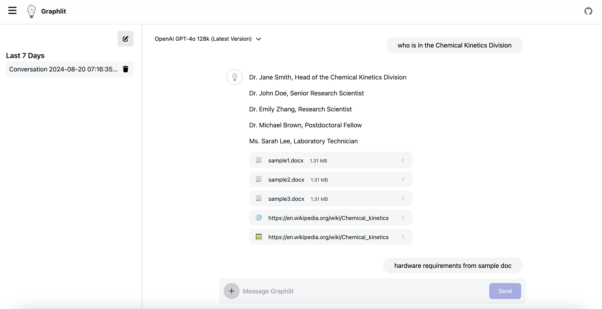

<br /><br />

<p align="center">
  
</p>

<h3 align="center"><b>Graphlit Chat</b></h3>

<p>
      
</p>

## New to Graphlit?

- **Step 1:** [Sign up for Graphlit 🆓](https://docs.graphlit.dev/getting-started/signup)
- **Step 2:** [Create a project](https://docs.graphlit.dev/getting-started/create-project)

## ⚡️ Quick start

### Requirements

- Node.js 18.17 and above

### Run locally

Clone the repository:

```bash
git clone git@github.com:graphlit/nextjs-samples.git
cd chat
```

Install packages:

```bash
npm i
```

First, copy the `.env.example` file to `.env` and fill in the required environment variables:

- `GRAPHLIT_ORGANIZATION_ID`
- `GRAPHLIT_ENVIRONMENT_ID`
- `GRAPHLIT_JWT_SECRET`

```bash
cp .env.example .env
```

Run the development server:

```bash
npm run dev
```

Open [http://localhost:3000](http://localhost:3000) with your browser to see the result.

## Deploy on Vercel

[](https://vercel.com/new/clone?repository-url=https%3A%2F%2Fgithub.com%2Fgraphlit%2Fnextjs-samples%2Ftree%2Fmain%2Fchat&env=GRAPHLIT_ORGANIZATION_ID,GRAPHLIT_ENVIRONMENT_ID,GRAPHLIT_JWT_SECRET&project-name=graphlit-chat)

The easiest way to deploy your Next.js app is to use the [Vercel Platform](https://vercel.com/new?utm_medium=default-template&filter=next.js&utm_source=create-next-app&utm_campaign=create-next-app-readme) from the creators of Next.js.

Check out our [Next.js deployment documentation](https://nextjs.org/docs/deployment) for more details.
